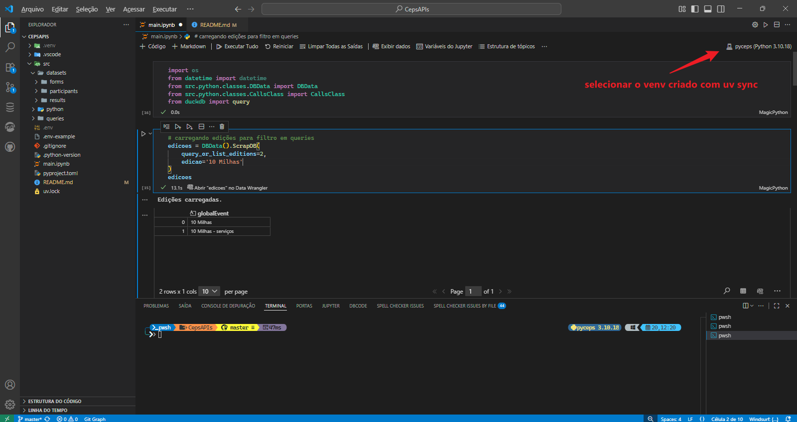
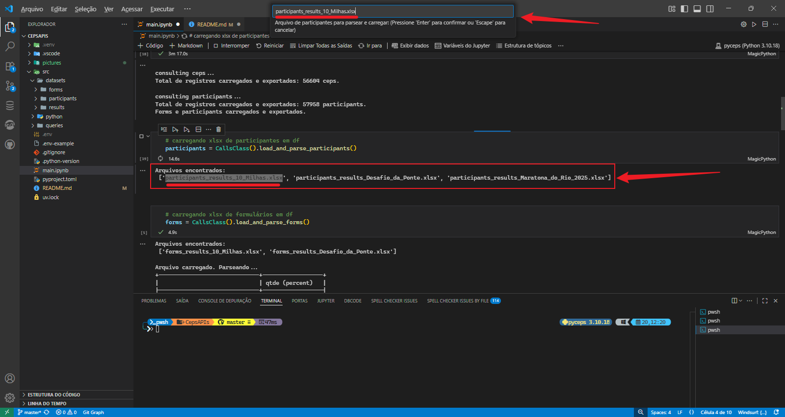

# APIs CEPs to Addresses

Para atender a demanda de CEPs do job. Busca em 3 APIs gratuitas (com `fallbacks`) os endereços com base no CEP.

* [brasilapi](https://brasilapi.com.br/)
* [viacep](https://viacep.com.br/)
* [apicep](https://apicep.com/api-de-consulta/)

Das funcionalidades principais:

* Consulta o DB e retorna as bases, exportando-as para `datasets`;
* Chama as APIs com `fallbacks` entre elas;
* Une as informações e exporta para `datasets/results`.

### Requisitos:

* [Python 3.10](https://www.python.org/downloads/release/python-3100/)
* [uv pkg manager](https://docs.astral.sh/uv/getting-started/installation/#installation-methods)
* [Extensão do Jupyter no VSCode](https://marketplace.visualstudio.com/items?itemName=ms-toolsai.jupyter)


No terminal:

```
git clone https://github.com/vihmalmsteen/ceps.git
uv sync
```

O comando `uv sync` cria o ambiente virtual (`venv`) e instala as libs em `pyproject.toml`.

### Do projeto:

```
ceps/
├─ .vscode/
│  └─ settings.json
├─ src/
│  ├─ datasets/
│  ├─ python/
│  │  ├─ classes/
│  │  │  ├─ CallsClass.py
│  │  │  └─ DBData.py
│  │  └─ main.py
│  └─ queries/
│     ├─ select_ceps.sql
│     ├─ select_editions.sql
│     └─ select_participants.sql
├─ .env-example
├─ .gitignore
├─ .python-version
├─ main.ipynb
├─ pyproject.toml
├─ README.md
└─ uv.lock
```

### Do uso:



Arquivo principal é o `main.ipynb` (foto acima). Basta executar as células do notebook e prosseguir conforme orientação. Fluxo:


**Da célula 1:** Importa os módulos necessários.

```py
import os
from datetime import datetime
from src.python.classes.DBData import DBData
from src.python.classes.CallsClass import CallsClass
from duckdb import query
```


**Da célula 2:** Procura as edições via regexp pelo parâmetro `edicao` e imprime os resultados (`query_or_list_editions=2`).

```py
edicoes = DBData().ScrapDB(
    query_or_list_editions=2,
    edicao='10 Milhas'
)
edicoes
```

**Da célula 3:** Consulta no banco as listas de participantes e suas respostas de formulário (`query_or_list_editions=1`) de uma determinada edição (parâmetro `edicao`, mesma string retornada na célula 2), dos tickets vendidos entre `data_compra_ini` e `data_compra_fini`, retornando um limite de linhas (`limit_max_rows`). O parâmetro `total_rows_in_batches` serve para separar os registros de ambas bases em clusters (um evento de 60 mil pessoas, pode-se criar N grupos de 2500 registros/grupo com `total_rows_in_batches=2500`).

```py
conn_query = DBData().ScrapDB(
    query_or_list_editions=1,
    edicao='10 Milhas',
    data_compra_ini='2022-05-01',
    data_compra_fini='2026-05-31',
    limit_max_rows=1000000,
    total_rows_in_batches=1000000
)
```

**Das células 4 e 5:** Carrega para dentro das variáveis `participants` e `forms` um arquivo xlsx de participantes e de formulários, respectivamente.

```py
participants = CallsClass().load_and_parse_participants()     # cell 4
forms = CallsClass().load_and_parse_forms()                   # cell 5
```

Para cada célula, será retornado os nomes dos arquivos encontrados nas respectivas pastas e perguntado o nome do arquivo a ser carregado no topo. Da célula 4 como exemplo:



**NOTA**

As bases retornadas para `src\datasets\forms` e `src\datasets\participants` retornam com um campo chamado `bacth` que recebe um número de cluster baseado no número setado no parâmetro `total_rows_in_batches`. Serve para separar de forma mais rápida, principalmente na base de formulário, grupos de registros para requisições em APIs. Caso uma determinada edição contenha muitas respostas de CEPs, pode ser necessário fazer fluxos de requisições distintos. Imagine um evento com 56604 participantes, cada um com um CEP a buscar. Se cada requisição leva em média 5 segs, demoraria mais de 78 horas para scrapear todos os CEPs. Casos assim, pode-se separar em grupos e fazer requisições sobre DataFrames diferentes, um para cada grupo, dando mais controle:

```py
# cell 3
conn_query = DBData().ScrapDB(
    query_or_list_editions=1,
    edicao='evento XPTO',                                        # consultando e gerando excels do evento XPTO
    data_compra_ini='2022-05-01',
    data_compra_fini='2026-05-31',
    limit_max_rows=1000000,
    total_rows_in_batches=2500                                   # cada batch terá 2500 registros
)

# cells 4 & 5
participants = CallsClass().load_and_parse_participants()        # selecionar o arquivo de participants de XPTO
forms = CallsClass().load_and_parse_forms()                      # selecionar o arquivo de forms de XPTO


# new cell: gerando df forms_batch_one somente com o 1 cluster
forms_batch_one = query('''
select * from forms where batch_number = 1    
''')

# cell 6
gets = CallsClass().triforce(
    parsed_ceps_df=forms_batch_one,                              # fazendo requisições sobre o novo DF gerado
    timeout=5
)
addresses_df = gets.get('complete_api_df')
```

**Da célula 6:** Faz requisições nas 3 APIs configuradas dentro do método `triforce`. O retorno é um dicionário contendo 3 objetos:

* `complete_api_df`: `DataFrame` com os dados dos CEPs;
* `complete_api_df_logs`: logs sobre as requisições;
* `ceps_errors_df`: CEPs que não foram possíveis de obter dados (por conta de preenchimento ruim, etc).

```py
gets = CallsClass().triforce(
    parsed_ceps_df=forms,
    timeout=5
)
addresses_df = gets.get('complete_api_df')
```

O parâmetro `timeout` é um tempo entre cada requisição em segundos. Para mitigar sobrecarga nas APIs, pode-se setar número mais alto.

**Da célula 7:** Junta a base de participantes carregada na célula 4 com os resultados das requisições (UF, cidade, bairro, logradouro) em um único `DataFrame` de nome `participants_and_addresses`.

```py
participants_and_addresses = query(
    query='''
    SELECT 
      participants.*
    , addresses_df.cep as cep
    , addresses_df.state as UF
    , addresses_df.city as cidade
    , addresses_df.neighborhood as bairro
    , addresses_df.street as logradouro
    FROM participants
    LEFT JOIN addresses_df
    ON participants.itemID = addresses_df.item_id
    '''   
).to_df()
```

**Da célula 8:** Exporta para `src\datasets\results` o DataFrame `participants_and_addresses` como um arquivo excel.

```py
folder = os.path.join(os.getcwd(), 'src', 'datasets', 'results')
os.makedirs(folder, exist_ok=True)

edition = participants['edição'].unique()[0].replace(' ','_')
current_time = datetime.now().strftime("%Y%m%d_%H%M")

result_df_path = os.path.join(folder, f'{edition}_{current_time}.xlsx')
participants_and_addresses.to_excel(result_df_path, index=False)

print(f'Arquivo {edition}_{current_time}.xlsx exportado.\npath: {result_df_path}')
```
